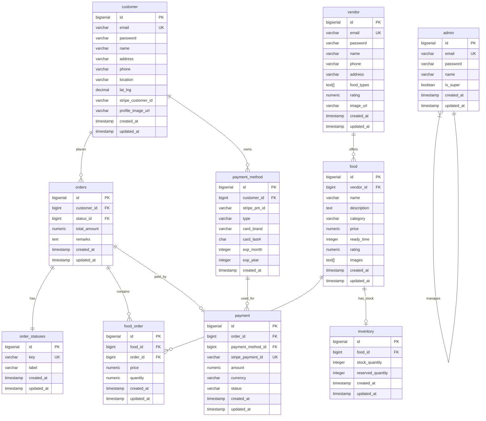
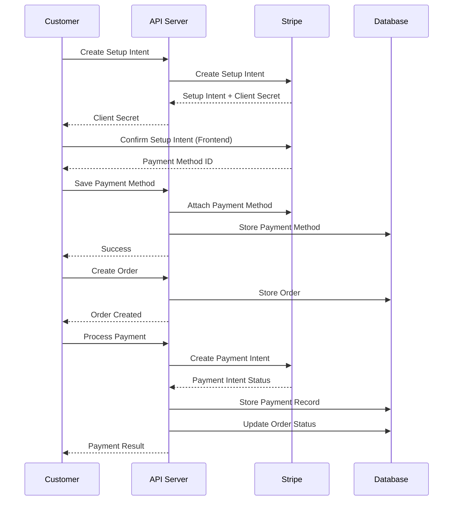
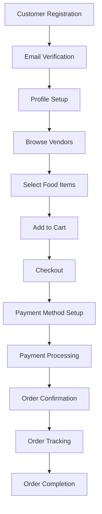
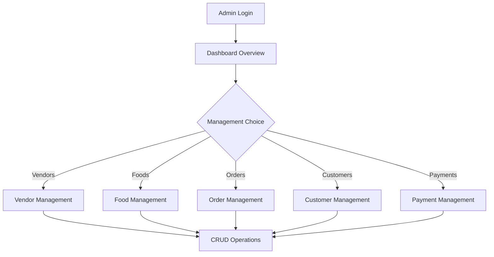

# Jomney - Food Delivery System Documentation

## Project Overview

**Jomney** is a comprehensive PHP-based food delivery system that connects customers with restaurants/vendors. The system provides a complete platform for food ordering, payment processing, and order management with separate interfaces for customers, vendors, and administrators.

### Key Features
- **Customer Management** - Registration, authentication, profile management
- **Vendor Management** - Restaurant/store management with menu handling
- **Order System** - Complete order lifecycle from placement to delivery
- **Payment Integration** - Stripe payment processing with saved payment methods
- **Admin Panel** - Complete administrative control over the system
- **Inventory Management** - Real-time stock tracking for food items
- **Multi-role Authentication** - JWT-based authentication for customers, vendors, and admins

---

## Architecture Overview

### Technology Stack
- **Backend**: PHP 8+ with custom MVC framework
- **Database**: PostgreSQL with complex relationships
- **Authentication**: JWT tokens with Firebase JWT library
- **Payment Processing**: Stripe API integration
- **Image Management**: Cloudinary for image uploads
- **Testing**: PHPUnit for unit testing

### Project Structure
```
php-foodDelivery/
├── app/
│   ├── Controllers/          # MVC Controllers
│   │   ├── Admin/           # Admin management controllers
│   │   ├── Customer/        # Customer-facing controllers
│   │   ├── PaymentController.php
│   │   └── public/          # Public API controllers
│   ├── Core/               # Core framework components
│   ├── Middleware/         # Authentication & authorization
│   ├── Models/             # Database models
│   ├── Sql/               # Database schema
│   └── Traits/            # Reusable PHP traits
├── database/
│   └── seeders/           # Database seeding scripts
├── public/
│   └── index.php          # Application entry point
├── tests/                 # Unit tests
└── vendor/                # Composer dependencies
```

---

## Database Architecture

### Entity Relationship Diagram



### Database Tables Details

#### Core Entity Tables

**1. customer**
- Primary user accounts for the food delivery platform
- Contains authentication, contact, and location information
- Supports Stripe customer ID for payment processing
- Links to orders and payment methods

**2. vendor** 
- Restaurant/store accounts that offer food items
- Contains business information, contact details, and ratings
- Supports multiple food types as an array
- Links to food items they offer

**3. food**
- Menu items offered by vendors
- Contains pricing, descriptions, categories, and images
- Includes ready time estimates and ratings
- Links to vendor and inventory

**4. admin**
- Administrative user accounts
- Supports super admin privileges
- Manages the entire platform

#### Order Management Tables

**5. orders**
- Central order tracking table
- Links customers to their orders
- Contains total amounts and status tracking
- Connected to order details through food_order

**6. food_order**
- Junction table for order line items
- Maps specific food items to orders
- Stores quantity and price at time of order
- Enables many-to-many relationship between orders and food

**7. order_statuses**
- Lookup table for order status management
- Configurable status types (pending, confirmed, delivered, etc.)
- Used for order lifecycle tracking

#### Payment System Tables

**8. payment_method**
- Stores customer payment methods
- Integrated with Stripe for secure payment processing
- Supports multiple payment types per customer
- Contains card information (safely tokenized)

**9. payment**
- Transaction records for completed payments
- Links orders to payment methods
- Tracks payment status and Stripe payment IDs
- Supports multiple currencies

#### Supporting Tables

**10. inventory**
- Stock management for food items
- Tracks available and reserved quantities
- Prevents overselling of food items
- Real-time inventory updates

### Key Relationships

1. **Customer → Orders** (1:Many): Customers can place multiple orders
2. **Vendor → Food** (1:Many): Vendors can offer multiple food items
3. **Order → Food** (Many:Many): Orders can contain multiple food items, food can be in multiple orders
4. **Customer → Payment Methods** (1:Many): Customers can have multiple saved payment methods
5. **Order → Payment** (1:1): Each order has one payment transaction
6. **Food → Inventory** (1:1): Each food item has inventory tracking

---

## API Architecture

### Authentication System

The system uses **JWT (JSON Web Tokens)** for authentication with role-based access control.

#### JWT Implementation
- **Library**: Firebase JWT with HS256 algorithm
- **Token Storage**: Bearer tokens in Authorization header
- **Roles**: customer, admin, vendor
- **Expiration**: Configurable token expiry

#### Middleware Classes

**1. AdminMiddleware**
- Validates admin JWT tokens
- Checks for "admin" role in token payload
- Protects admin-only endpoints

**2. CustomerMiddleware** 
- Validates customer JWT tokens
- Checks for "customer" role in token payload
- Protects customer-specific endpoints

**3. JWTMiddleware**
- Generic JWT validation
- Used for endpoints that require any authenticated user

**4. CorsMiddleware**
- Handles Cross-Origin Resource Sharing
- Enables frontend-backend communication

### API Endpoints Structure

#### Public Endpoints (No Authentication)
```
GET  /api/public/vendors           # List all vendors
GET  /api/public/foods            # List all foods  
GET  /api/public/vendors/{id}     # Vendor details with menu
GET  /api/public/foods/{id}       # Food item details
```

#### Customer Authentication
```
POST /api/v1/auth/register        # Customer registration
POST /api/v1/auth/login          # Customer login
POST /api/v1/auth/logout         # Customer logout (Auth required)
GET  /api/v1/auth/profile        # Get profile (Auth required)
PUT  /api/v1/auth/profile        # Update profile (Auth required)
```

#### Customer Order Management
```
POST /api/v1/orders              # Create order
GET  /api/v1/orders              # Order history
GET  /api/v1/orders/{id}         # Order details
DELETE /api/v1/orders/{id}       # Cancel order
```

#### Customer Payment Management
```
# Payment Methods
GET  /api/v1/payment-methods                    # List payment methods
POST /api/v1/payment-methods/stripe/setup-intent # Create setup intent
POST /api/v1/payment-methods/stripe/save       # Save payment method
DELETE /api/v1/payment-methods/stripe/{id}     # Remove payment method

# Payment Processing
POST /api/v1/orders/{id}/stripe-payment        # Process Stripe payment

# Payment History
GET  /api/v1/payments                          # Payment history
GET  /api/v1/payments/{id}                     # Payment details
```

#### Admin Authentication
```
POST /api/admin/login            # Admin login
POST /api/admin/logout           # Admin logout
GET  /api/admin/user            # Get admin profile
```

#### Admin Management Endpoints
```
# Dashboard
GET  /api/admin/stats            # Dashboard statistics

# Vendor Management
GET    /api/admin/vendors        # List vendors
POST   /api/admin/vendors        # Create vendor
GET    /api/admin/vendors/{id}   # Vendor details
PUT    /api/admin/vendors/{id}   # Update vendor
DELETE /api/admin/vendors/{id}   # Delete vendor

# Food Management
GET    /api/admin/foods          # List foods
POST   /api/admin/foods          # Create food
GET    /api/admin/foods/{id}     # Food details
PUT    /api/admin/foods/{id}     # Update food
DELETE /api/admin/foods/{id}     # Delete food

# Inventory Management
GET   /api/admin/foods/{id}/inventory        # Get inventory
PATCH /api/admin/foods/{id}/inventory/adjust # Adjust inventory

# Order Management
GET   /api/admin/orders          # List orders
GET   /api/admin/orders/{id}     # Order details
PATCH /api/admin/orders/{id}/status # Update order status

# Customer Management
GET    /api/admin/customers      # List customers
POST   /api/admin/customers      # Create customer
GET    /api/admin/customers/{id} # Customer details
PUT    /api/admin/customers/{id} # Update customer
DELETE /api/admin/customers/{id} # Delete customer

# Payment Management
GET /api/admin/payments          # List payments
GET /api/admin/payments/{id}     # Payment details
```

---

## Core Components

### 1. Models (Data Layer)

**Base Model Features:**
- Database connection management
- CRUD operations
- Query building
- Relationship handling

**Key Models:**

**Customer Model**
- User authentication and profile management
- Location and contact information
- Stripe customer integration
- Order history relationships

**Vendor Model**
- Business profile management
- Food type categorization
- Rating system
- Food item relationships

**Food Model**
- Menu item management
- Category and pricing
- Image gallery support
- Inventory integration

**Order Model**
- Order lifecycle management
- Status tracking
- Line item relationships
- Payment integration

**Payment Model**
- Transaction processing
- Stripe integration
- Payment method relationships
- Status tracking

### 2. Controllers (Business Logic)

#### Admin Controllers
Handle all administrative functions including user management, system monitoring, and configuration.

#### Customer Controllers  
Manage customer-facing functionality including ordering, payments, and profile management.

#### Public Controllers
Provide unauthenticated access to browse vendors and menu items.

### 3. Core Framework Components

**Database Class**
- PostgreSQL connection management
- Query execution and result handling
- Transaction support

**Router Class**
- URL routing and parameter extraction
- HTTP method handling
- Middleware integration

**Response Class**
- Standardized API response formatting
- Status code management
- Error handling

**JWTService Class**
- Token generation and validation
- Role-based access control
- Secure token management

**CloudinaryService Class**
- Image upload and management
- CDN integration
- Image transformation

---

## Payment System Integration

### Stripe Integration Features

**1. Payment Methods Management**
- Secure payment method storage
- Setup Intents for card saving
- Payment method CRUD operations

**2. Payment Processing**
- PaymentIntents for transaction processing
- 3D Secure authentication support
- Off-session payment capability

**3. Customer Management**
- Stripe Customer creation and management
- Payment method attachment
- Customer data synchronization

**4. Webhook Handling**
- Real-time payment status updates
- Failed payment handling
- Dispute management

### Payment Flow



---

## Security Features

### Authentication Security
- **JWT Tokens**: Secure, stateless authentication
- **Password Hashing**: Bcrypt for password storage
- **Role-based Access**: Granular permission control
- **Token Expiration**: Configurable token lifetime

### Payment Security
- **PCI Compliance**: Stripe handles sensitive card data
- **Tokenization**: Card details never stored directly
- **Webhook Verification**: Stripe signature validation
- **HTTPS Only**: Secure data transmission

### Data Security
- **SQL Injection Prevention**: Parameterized queries
- **Input Validation**: Server-side validation
- **CORS Protection**: Cross-origin request control
- **Error Handling**: Secure error messaging

---

## Development Features

### Code Organization
- **MVC Architecture**: Clean separation of concerns
- **PSR-4 Autoloading**: Modern PHP class loading
- **Namespace Organization**: Logical code structure
- **Trait Usage**: Code reusability

### Testing
- **PHPUnit Integration**: Unit testing framework
- **Test Structure**: Organized test suites
- **Mock Support**: External service mocking

### Error Handling
- **Custom Exceptions**: Specific error types
- **Global Error Handler**: Centralized error management
- **Logging**: Error tracking and debugging
- **User-friendly Messages**: Clean error responses

---

## Deployment Configuration

### Environment Variables
```env
# Database Configuration
DB_HOST=localhost
DB_NAME=food_delivery
DB_USER=username
DB_PASS=password

# JWT Configuration
JWT_SECRET=your-secret-key
JWT_EXPIRY=3600

# Stripe Configuration
STRIPE_SECRET_KEY=sk_test_...
STRIPE_PUBLISHABLE_KEY=pk_test_...

# Cloudinary Configuration
CLOUDINARY_CLOUD_NAME=your-cloud
CLOUDINARY_API_KEY=your-key
CLOUDINARY_API_SECRET=your-secret
```

### Docker Support
- **docker-compose.yml**: Multi-container deployment
- **Dockerfile**: Application containerization
- **Apache Configuration**: Web server setup

---

## API Response Format

### Success Response
```json
{
    "success": true,
    "message": "Operation completed successfully",
    "data": { /* response data */ },
    "status_code": 200
}
```

### Error Response
```json
{
    "success": false,
    "message": "Error description",
    "data": [],
    "status_code": 400
}
```

---

## Business Logic Flow

### Order Processing Flow
1. **Customer places order** → Inventory check
2. **Stock validation** → Reserve inventory
3. **Payment processing** → Stripe integration
4. **Order confirmation** → Status update
5. **Vendor notification** → Order fulfillment
6. **Delivery tracking** → Status updates
7. **Order completion** → Inventory adjustment

### User Journey Flows

**Customer Registration & Ordering:**


**Admin Management Flow:**


---

## Future Enhancements

### Planned Features
- **Real-time Notifications**: WebSocket integration
- **GPS Tracking**: Delivery location tracking
- **Rating & Reviews**: Customer feedback system
- **Loyalty Program**: Customer rewards
- **Multi-vendor Orders**: Single order from multiple vendors
- **Scheduled Orders**: Future order placement
- **Promotional System**: Discounts and coupons

### Technical Improvements
- **API Rate Limiting**: Request throttling
- **Caching Layer**: Redis integration
- **Search Optimization**: Elasticsearch integration
- **Mobile App API**: Dedicated mobile endpoints
- **Analytics Integration**: Business intelligence
- **Automated Testing**: CI/CD pipeline

---

## Conclusion

Jomney represents a comprehensive, scalable food delivery platform built with modern PHP practices. The system provides robust functionality for all stakeholders - customers, vendors, and administrators - while maintaining security, performance, and maintainability standards.

The modular architecture allows for easy extension and customization, making it suitable for various deployment scenarios from small local businesses to large-scale operations.

---

*Documentation Version: 1.0*  
*Last Updated: December 2024*  
*Project: Jomney Food Delivery System*
